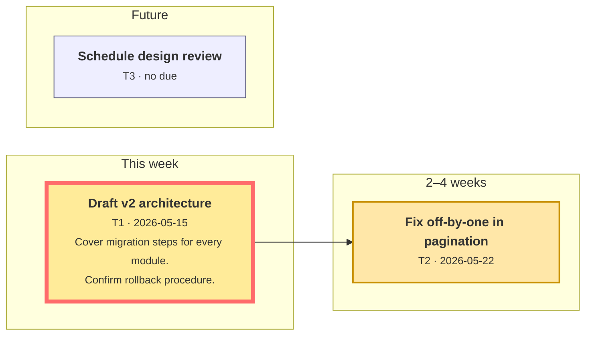

# hablon

> *Hablon* is a traditional handwoven textile from the Western Visayas in the Philippines — threads interlocked into a deliberate pattern. This tool weaves your tasks together the same way: explicit dependencies, grouped by when they're due, rendered as a Mermaid diagram.

A single-binary-style Python REPL for tracking personal/per-project tasks. Stdlib only. Plain JSON on disk, Markdown + Mermaid for visualization.

[](LICENSE) [](https://www.python.org/)

## Why

- **Forward-looking.** Tasks are grouped automatically into *Past due*, *Today*, *This week*, *2–4 weeks*, and *Future* based on each task's due date relative to today. Run `reorganize` and the diagram re-buckets against the current date — no manual reordering as plans age.
- **Dependencies are first-class.** `depend T2 on T1` becomes an edge in the Mermaid flowchart. Cycles are rejected on save.
- **Everything is text.** JSON source of truth, Markdown view file, both readable by hand and easy to diff in git.
- **No services, no API keys, no third-party packages.** Python 3.10+ stdlib only.

## Install

There's nothing to install. Clone the repo and run the entry script:

```
git clone <repo> hablon
cd hablon
python hablon.py
```

The `projects/` folder (per-project data) is `.gitignored` so your tasks won't pollute the tool's history.

To see Mermaid diagrams rendered in VS Code's preview, install [Markdown Preview Mermaid Support](https://marketplace.visualstudio.com/items?itemName=bierner.markdown-mermaid):

```
code --install-extension bierner.markdown-mermaid
```

GitHub renders the same `.md` files natively without any extension.

## Quick tour

```
$ python hablon.py
hablon — weave your tasks together.
Type `help` for commands, `mkproject <name>` or `use <name>` to select a project, `exit` to quit.
hablon> mkproject demo
Created project: demo
demo (0 open, 0 overdue)> add "Draft v2 architecture" --due 2026-05-15 --big-ticket
demo (1 open, 0 overdue)> add "Fix off-by-one in pagination" --due 2026-05-22 --depends T1
demo (2 open, 0 overdue)> add "Schedule design review"
demo (2 open, 0 overdue)> notes T1
Enter notes for T1. End with a single '.' on its own line.
... Cover migration steps for every module.
... Confirm rollback procedure.
... .
demo (2 open, 0 overdue)> start T2
demo (2 open, 0 overdue)> render
Rendered projects/demo/tasks.md.
```

The resulting `projects/demo/tasks.md` renders as:



Open `projects/demo/tasks.md` in VS Code (with the Mermaid extension) or push it to GitHub to see the woven diagram.

## Layout

```
hablon/
├── hablon.py              # entry point
├── src/hablon/            # implementation
├── tests/                 # pytest suite (stdlib only)
├── projects/              # gitignored — your task data
│   └── <project>/
│       ├── tasks.json     # source of truth
│       └── tasks.md       # auto-generated Mermaid view
├── pyproject.toml
└── README.md
```

Every mutating command auto-regenerates `tasks.md` so the view never drifts from the JSON.

## Commands

All commands accept arguments at the REPL prompt — no flags repeated across invocations.

### Projects

| Command | Purpose |
|---|---|
| `mkproject <name>` | Create a new project and switch to it. Errors if it already exists. |
| `use <name>` | Switch active project. Offers to create on the fly. |
| `projects` | List all projects with open/active counts; `*` marks the active one. |

### Tasks

| Command | Purpose |
|---|---|
| `add "<title>" [--due YYYY-MM-DD] [--depends T1,T2] [--notes "..."] [--big-ticket]` | Create a task. `\n` inside `--notes` becomes a newline. |
| `list [open\|active\|delegated\|done\|all] [--bucket past\|today\|week\|month\|future] [--big-ticket]` | Tabular view. Default hides done/cancelled. |
| `show <id>` | Full detail for one task with multi-line notes rendered. |
| `edit <id> [--title ...] [--due ...] [--clear-due] [--notes ...]` | Mutate fields. |
| `notes <id>` | Enter multi-line notes mode. End with a `.` on its own line. |
| `rm <id> [--force]` | Delete (refuses if other tasks depend on it without `--force`). |

### Status lifecycle

| Command | Effect |
|---|---|
| `start <id>` | → `active`; stamps `started` if not already set. |
| `delegate <id>` | → `delegated`. |
| `done <id>` | → `done`; stamps `completed`. |
| `cancel <id>` | → `cancelled`; stamps `completed` with the cancellation time. |
| `reopen <id>` | → `open`; clears `completed`, preserves `started`. |
| `tag <id> --big-ticket` / `untag <id> --big-ticket` | Toggle the big-ticket emphasis flag (orthogonal to status). |

### Dependencies

| Command | Purpose |
|---|---|
| `depend <id> on <other-id>` | Add a "blocks/blocked-by" edge. Cycle-checked on save. |
| `undepend <id> on <other-id>` | Remove the edge. |

### Rendering

| Command | Effect |
|---|---|
| `render [--no-past] [--show-done]` | Regenerate `tasks.md`. |
| `future` | Alias of `render --no-past`. |
| `reorganize` | Alias of `render`. Intent: re-bucket against today. |

## How tasks land in buckets

For each task with a `due` date:

| Days from today | Bucket |
|---|---|
| `< 0` (overdue) | **Past** |
| `= 0` (due today) | **Today** |
| `1 – 7` | **This week** |
| `8 – 28` | **2–4 weeks** |
| `> 28` | **Future** |

For a task **without** a `due` date, hablon walks **forward** through the dependency graph — following tasks that depend *on* the no-due task — and assigns the bucket of the first dated task reached. Isolated no-due tasks (no forward dependents with a due date) fall back to Future.

`render --no-past` (a.k.a. `future`) hides only **done** and **cancelled** tasks from the past bucket. Overdue tasks that are still `open` / `active` / `delegated` stay visible — they still need attention.

## Visual style

Mermaid output uses:

- Bold task title with the ID, due date, and the first 2 lines of notes (truncated with `…`) underneath in `<small>` text.
- Status-driven CSS classes: `open` (pale blue), `active` (amber, thick), `delegated` (purple, dashed), `done` (green, muted), `overdue` (red — applied to any past-bucket task regardless of status).
- `big_ticket` **overrides** the status class — a big-ticket task renders with the `big_ticket` style regardless of its current status.

## License

MIT — do what you like with it.
